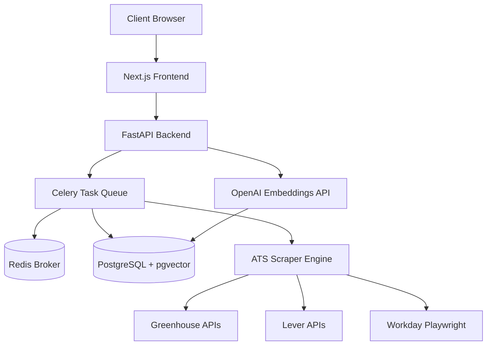

# AutoApply

AutoApply is an automated job aggregation and matching platform. It scrapes application tracking systems (ATS) such as Greenhouse, Lever, and Workday, parses resumes using natural language processing, and performs semantic matching using vector embeddings to identify the most relevant job opportunities.

## Architecture

The platform consists of a frontend application and a backend processing engine.



## Setup Instructions

### Local Development

1. Set your environment variables:
   - OPENAI_API_KEY
   - DATABASE_URL
   - REDIS_URL

2. Start the services using Docker Compose:
   ```bash
   docker-compose up --build
   ```

3. Access the web interface at `http://localhost:3000`.

### Infrastructure Components

- Frontend: Next.js 14, Tailwind CSS, Framer Motion
- Backend API: FastAPI, Python 3.11
- Task Queue: Celery, Redis
- Database: PostgreSQL with pgvector extension
- AI Integration: OpenAI API for embeddings and analysis
- Scraping Engine: httpx (for direct JSON APIs), Playwright (for dynamic rendering)
